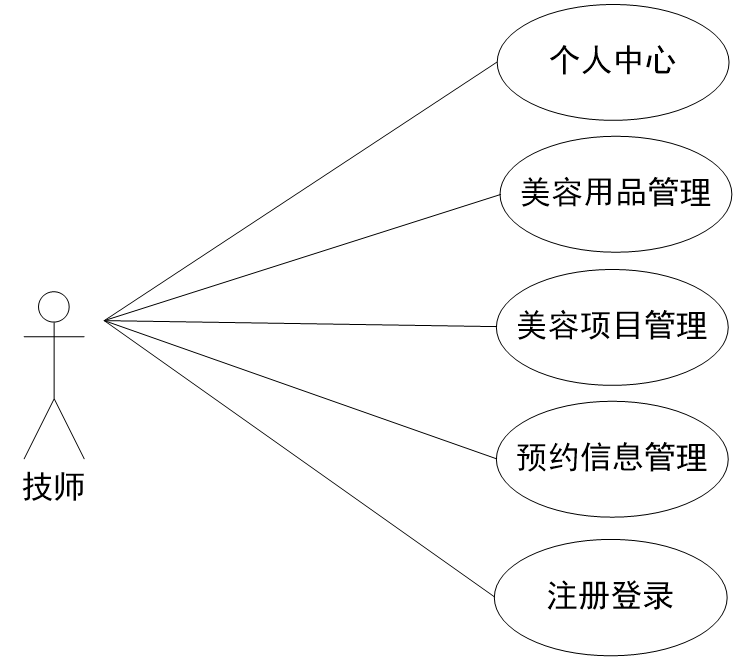
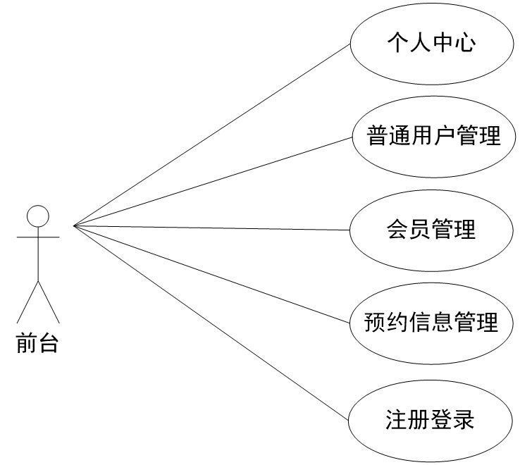
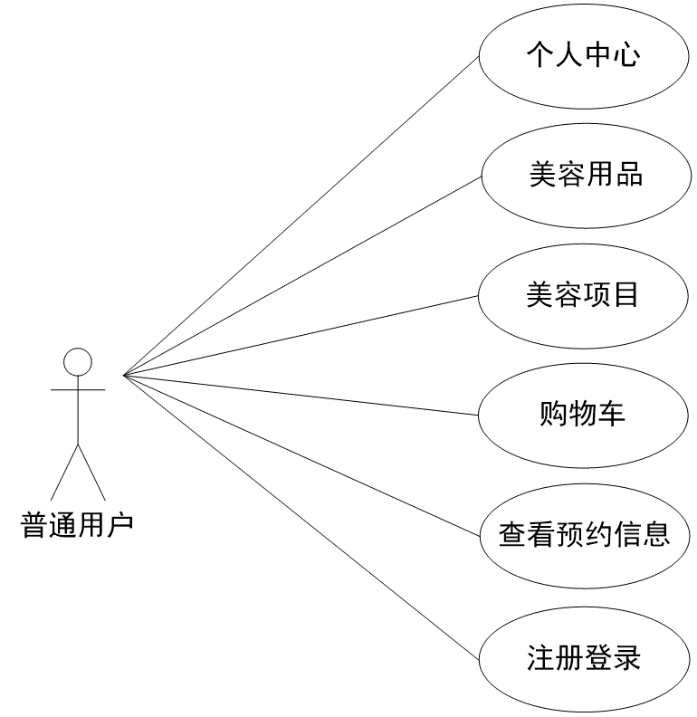
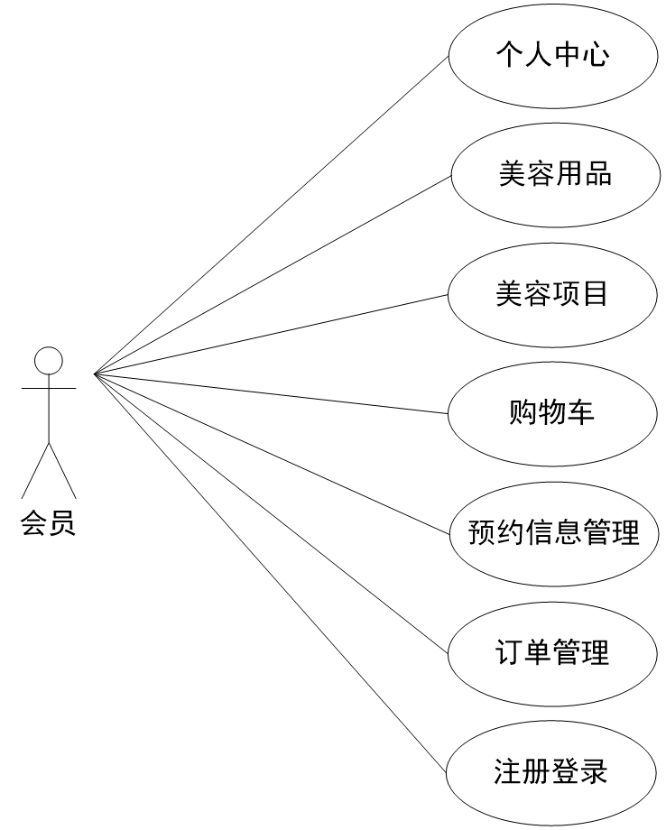
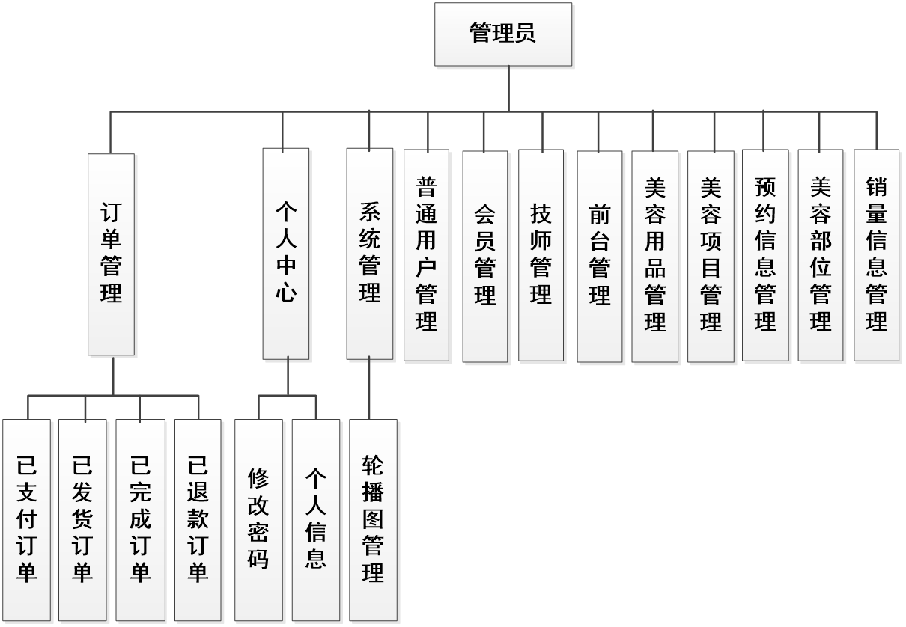
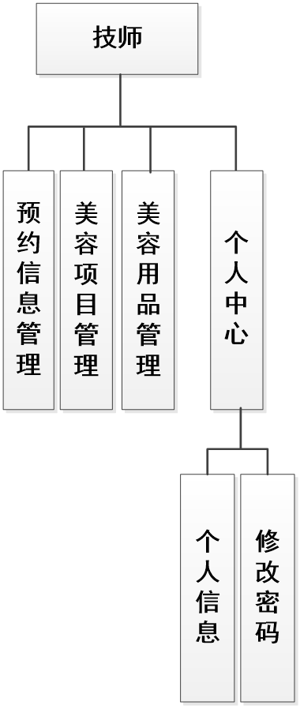
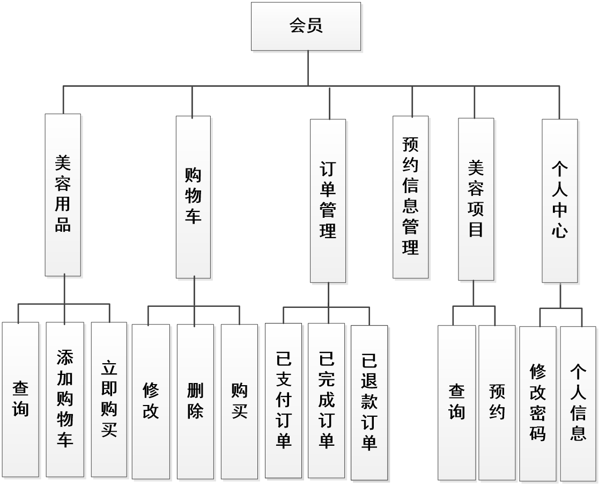
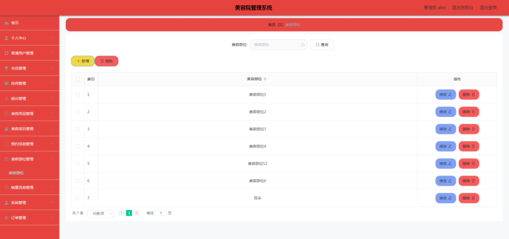
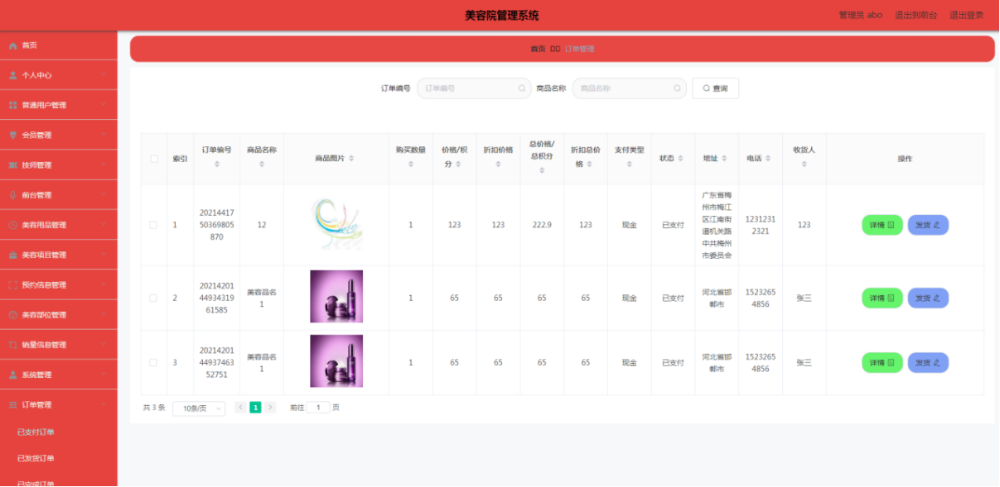
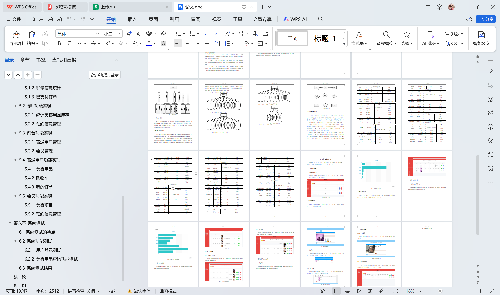

# springboot044-基于SpringBoot的美容院管理系统

>  博主介绍：
>  Hey，我是程序员Chaers，一个专注于计算机领域的程序员
>  十年大厂程序员全栈开发‍ 日常分享项目经验 解决技术难题与技术推荐 承接各类网站设计，小程序开发，毕设等。
>  【计算机专业课程设计，毕业设计项目，Java，微信小程序，安卓APP都可以做，不仅仅是计算机专业，其它专业都可以】

## 3000套系统可挑选，获取链接：https://chaerspol.github.io/

<b>QQ【获取完整源码】：674456564</b>

<b>QQ群【获取完整源码】：1058861570</b>

### 系统架构

> 前端：html | js | css | jquery | vue
>
> 后端：springboot | mybatis
> 
> 环境：jdk1.8+ | mysql | maven

# 一、内容包括
包括有  项目源码+项目论文+数据库源码+答辩ppt+远程调试成功

# 二、运行环境

> jdk版本：1.8 及以上； ide工具：IDEA； 数据库: mysql5.7及以上；编程语言: Java

# 三、需求分析

**3.1可行性分析**

这部分内容主要从开发的角度和运行使用的角度等层面研究系统，确定是否投资系统，为进一步开展工作提供理论依据。

**3.1.1技术可行性**

本系统采用的技术和开发类语言都具备丰厚的理论基础，同时这些开发技术和开发语言在市面上都得到了广泛运用，很多功能实现的源码都以模块化的方式通过网络进行了公开，所以本系统可以参考这些代码实现功能。因此，系统开发技术可行。

**3.1.2操作可行性**

美容院管理系统根据用户阅读习惯对系统内容进行排版布局，把系统页面中的关键位置用来设置导航条，可以方便用户第一时间找到需要的内容，同时，页面中也会设置一些提示，用于帮助用户操作系统，因此，系统操作可行。

**3.1.3经济可行性**

本系统需要在硬件设备上配置开发环境，就可以开展系统的开发工作。由于本系统并不是商业化程序，所以本人学习用的笔记本，或机房电脑都符合要求。对于开发环境的配置问题，可以通过网络直接下载安装，期间并不收取费用。因此，系统经济可行。
以上就是从技术，操作，经济的层面研究系统，最终确定系统可以开展。

**3.2系统流程分析**

要访问美容院管理系统，需要符合要求的身份，证明访问者身份的信息就是在登录界面需要填写的信息，其中有用户名，有密码。在登录界面，系统后台也有专门编写的安全验证机制，只有信息匹配的访问者才有资格进入系统。具体流程见下图。如果访问者提供的信息在数据库中没有记录，就表明该访问者没有权限，也就无法享受系统提供的服务。

**3.3系统功能分析**

这部分内容在系统分析环节比较重要，它直接关系本系统开发的进展。无论是设计，还是实现，都是在本系统调研的功能的基础上进行。
为了直观显示系统的功能，运用用例图这样的工具显示分析的结果。分析的管理员功能如下。管理员管理美容用品，美容项目，美容部位，管理技师预约，管理订单，统计美容用品销量。

为了直观显示系统的功能，运用用例图这样的工具显示分析的结果。分析的技师功能如下。技师统计美容用品库存，管理美容项目，审核会员预约信息。

为了直观显示系统的功能，运用用例图这样的工具显示分析的结果。分析的前台功能如下。前台负责普通用户与会员的管理，审核会员预约信息。

为了直观显示系统的功能，运用用例图这样的工具显示分析的结果。分析的普通用户功能如下。普通用户购买美容用品，管理购买订单，管理收货地址。

为了直观显示系统的功能，运用用例图这样的工具显示分析的结果。分析的会员功能如下。会员购买美容用品，预约美容项目，管理预约信息以及购买订单。

# 四、功能模块

这部分内容使用结构图这样的工具，显示设计结果，设计的管理员功能见下图。管理员管理美容用品，美容项目，美容部位，管理技师预约，管理订单，统计美容用品销量。

这部分内容使用结构图这样的工具，显示设计结果，设计的技师功能见下图。技师统计美容用品库存，管理美容项目，审核会员预约信息。

这部分内容使用结构图这样的工具，显示设计结果，设计的前台功能见下图。前台负责普通用户与会员的管理，审核会员预约信息。

这部分内容使用结构图这样的工具，显示设计结果，设计的普通用户功能见下图。普通用户购买美容用品，管理购买订单，管理收货地址。
    

这部分内容使用结构图这样的工具，显示设计结果，设计的会员功能见下图。会员购买美容用品，预约美容项目，管理预约信息以及购买订单。

# 五、部分效果图展示

图5-1 美容部位管理页面【实现管理员权限的美容部位管理功能，其运行效果见下图。管理员修改美容部位信息，删除美容部位信息，新增美容部位信息】

图5-2 销量信息统计页面【实现管理员权限的销量信息统计功能，其运行效果见下图。管理员通过销量统计报表查看各种美容用品的销量信息】

图5-3 已支付订单页面【实现管理员权限的已支付订单功能，其运行效果见下图。管理员查看已支付订单信息，查看下单人提供的收货地址，然后进行订单发货。】

 <b>完整文章</b>
 

 

## 3000套系统可挑选，获取链接：https://chaerspol.github.io/

<b>QQ【获取完整源码】：674456564</b>

<b>QQ群【获取完整源码】：1058861570</b>

